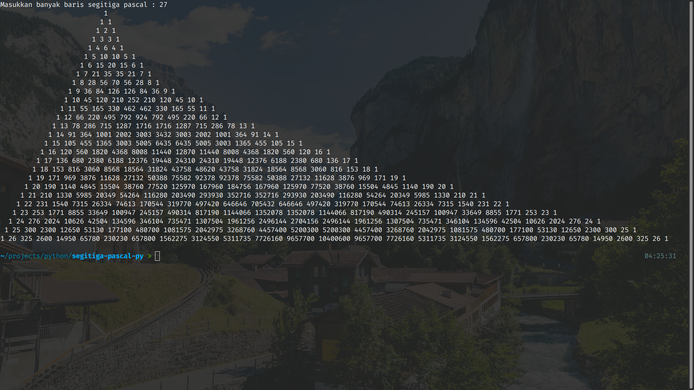

# Segitiga Pascal

Ini adalah program yang dibuat dengan bahasa pemrograman Python. Program ini berfungsi untuk membuat pola segitiga pascal dengan n baris. Selamat mencoba.

## <b>About Me</b>

I'm a student at Del Institute of Technology.  
Bachelor of Informatics study program.  

<button><a href="https://www.instagram.com/gabrielhtg77/">My Instagram</a></button>
 
<button><a href="https://www.del.ac.id/">Institut Teknologi Del</a></button>

